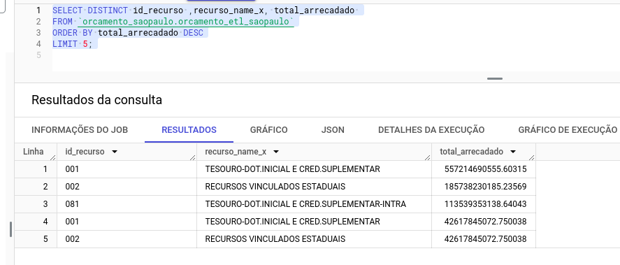
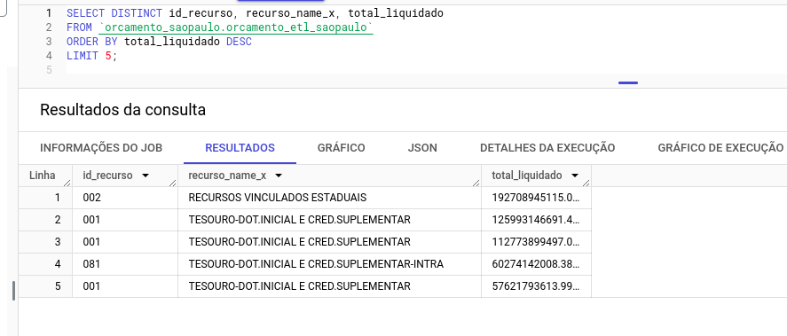
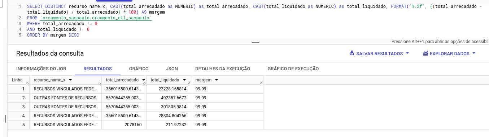
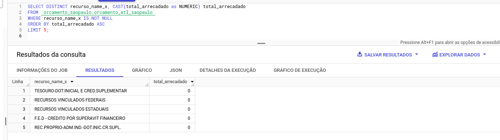
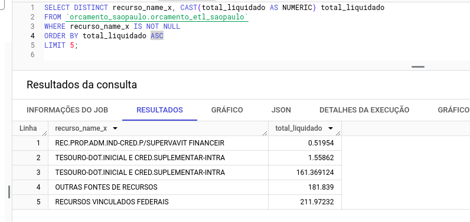
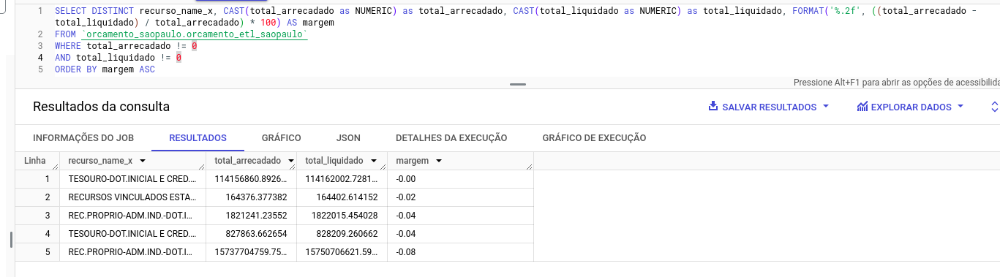
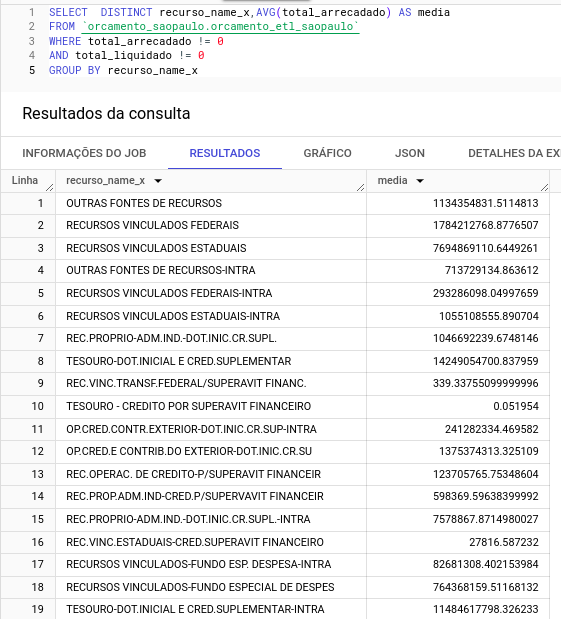
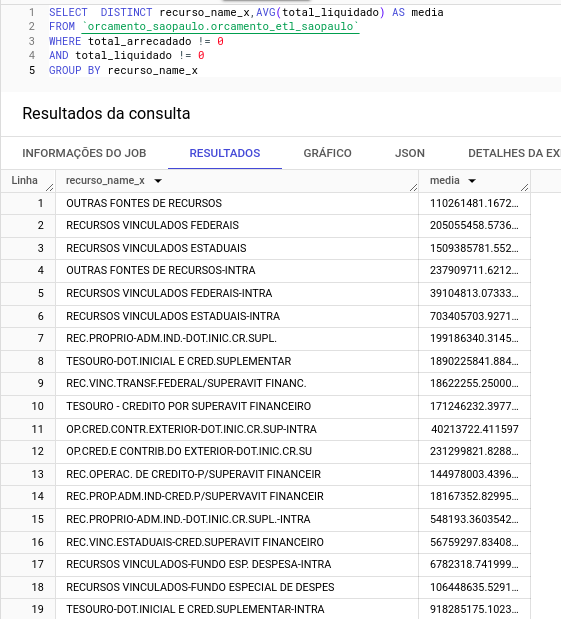

ETL Karhub
========

Pipeline voltado para a operação de ETL de dados no formato de CSV e aquisições em API para coleta expecifica de informações. 

## GCP tools
- Google CloudFunction
- Goolge Bigquery
- Airflow - Astro

## Orquestration
- Airflow - Astro

## Libs
- Pandas: Voltada para o processamento
- logging: Exibição de logs
- Requests: Aquisição de informações em API

## Infrastructure - GCP
- Terraform 

## Explanation
O pipenile consiste em uma unico arquivo python voltado para o processamento usando biblioteca como pandas, requests e logging. O pandas acabou sendo usado para a extrção e limpeza desses dados, enquanto o requests foi usado para o a requisão na API disponivel e o logging para acompanhar as sequencias de execução do pipeline.

`Google Cloud Functions`: Pensando na quantidade de dados disponibilizada, acredito que para o processamento faria mais sentido o uso de uma ferramenta Serveless, já que não teriamos a necessidade de paralelizar a operação, então a ferrementa escolhida foi o `Cloud Functions` da própria GCP, principalmente por não exigir a necessidade tão grande de configurção e por ter a caracteristica de ser Serveless.

`Goolge Bigquery`: O uso do Bigquery foi feito com base na exigência do avaliador.

`Airflow - Astro`: Pensando na falicidade de deploy de uma ambiente Airflow atualizado, foi feita a escolha do Astro, que nada mais é quem um ambiente open-source e de facil uso para fins de desenvolvimento. Foram cogitado o uso do Airflow em softwares como Cloud Compose ou sendo executado em uma Compute Engine, mas focando em simplacidade acabei optando pelo o deploy local.

`Terraform`: Escolhido principalmente pelo facil gerenciamento, configuração de ambiente e principalmente pela facilidade para encerrar o uso de todos os recursos.

## Resultados

1 - Query:

2 - Query:

3 - Query:

4 - Query:

5 - Query:

6 - Query:

7 - Query:

8 - Query:
